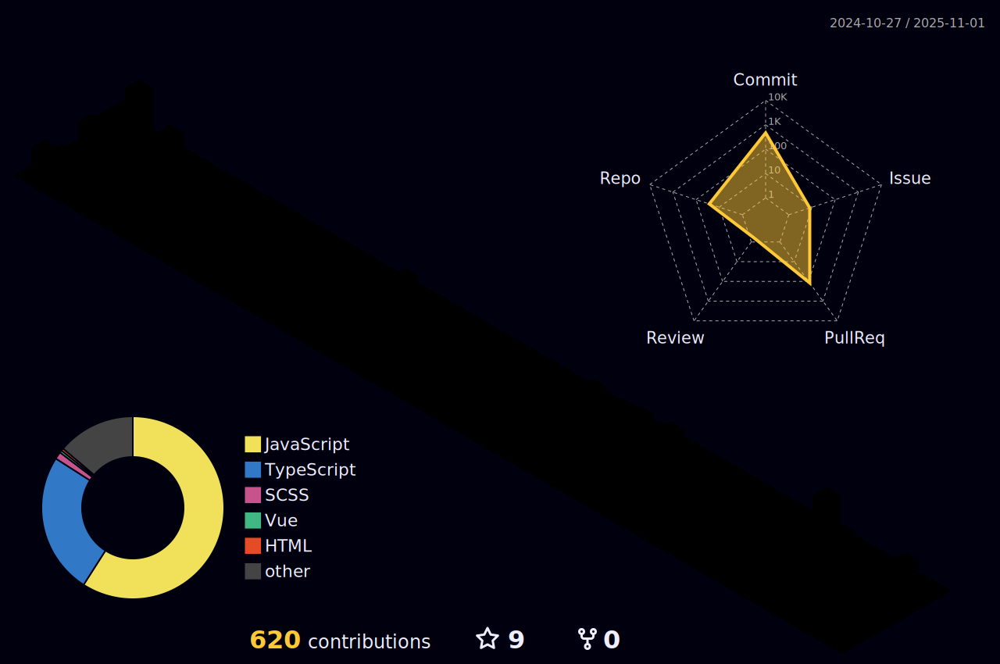

## Hi there 👋
<!--  -->

## About Me​
💻 ​Frontend Development Engineer​

🎯 Formerly spearheaded frontend architecture upgrades for the ​LightClass System​ & ​On-Demand Platform​ at Gaodun Education. Currently driving responsive redesign of the ​AI Model Security Evaluation System​ at NSFOCUS Technologies.

❤️‍🔥 Passionate about building enterprise-grade applications with ​React + TypeScript, delivering secure and efficient digital solutions through clean code.

🚀 Actively exploring cutting-edge domains like ​data visualization engines, with multiple open-source contributions to ByteDance's ​VisActor​

## Welcome to my Github

<!-- 
## I can

## Welcome to my Github

  
   

<!--  -->

<!-- 
 -->

<!--  -->
<!--  --> 

